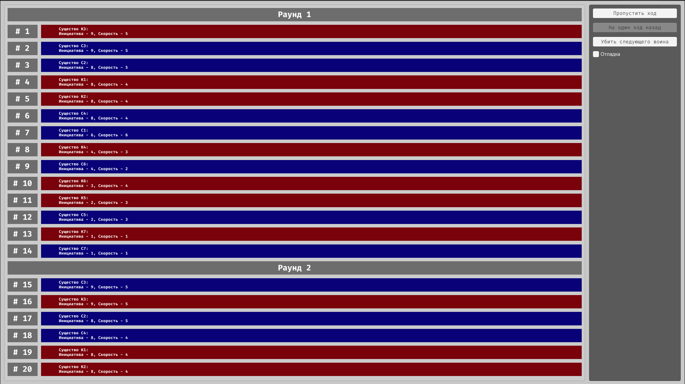
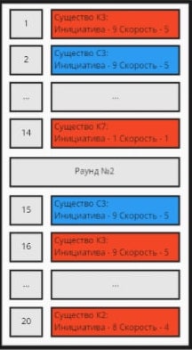

# Симулятор очереди ходов воинов

Задача - просимулировать очередь ходов в пошаговом бое и построить порядок хода от текущего воина на 20 шагов вперед.

В бою принимаю участие две армии: Красные и Синие.

Армия состоит из 7 войнов. Бой состоит из раундов. В каждый раунд воин совершает один ход.
Порядок ходов воинов определяется по определённым правилам. Когда все войны походили - начинается новый раунд.

## Правила порядка хода

<table cellpadding="0" cellspacing="0" border="0">
<tr>
<td width="30%" style="border: none!important;">

</td>
<td style="border: none!important;">
Нужно вывести на экран порядок хода на ближайшие 20 ходов. Самый
верхний - воин который сейчас ходит. Отобразить конец раунда.

Есть две кнопки действия:
- Пропустить ход
- Убить спедующего война в очереди

После совершения действия очередь обновляется. Те. при пропуске хода - первый воин из списка убирается, порядок хода смещается вверх, а на 20 место очереди приходит новый воин. При убийстве следующего война - убирается второй воин из списка и происходит перерасчет порядка хода с новыми водными данным (13 воинов вместо 14).

Воин имеет характеристики: ячейка (порядковый номер в армии), инициатива, скорость.
- Раньше ходят войны с большей инициативой.
- Если инициатива одинаковая - раньше ходят воины с большей скоростью.
- В случае равенства инициативы и скорости существа ходят при приоритету - в нечетном раунде приоритет у красных, в четном - у синих.
- В случае равенства инициативы и скорости воинов в рамках одной армии, раньше ходит воин с наименьшим номером ячейки
</td>
</tr>
</table>

## Характеристики воинов

### Армия красных

1. ячейка - К1 - Инициатива = 8, Скорость = 4
2. ячейка - К2 - Инициатива = 8, Скорость = 4
3. ячейка - КЗ - Инициатива = 9, Скорость = 5
4. ячейка - Ка - Инициатива = 4, Скорость = 3
5. ячейка - КБ - Инициатива = 2, Скорость = 3
6. ячейка - Кб - Инициатива = 3, Скорость = 4
7. ячейка - К7 - Инициатива = 1, Скорость = 1

### Армия синих

1. ячейка - С1 - Инициатива = 6, Скорость = 6
2. ячейка - С2 - Инициатива = 8, Скорость = 5
3. ячейка - СЗ - Инициатива = 9, Скорость = 5
4. ячейка - С4 - Инициатива = 8, Скорость = 4
5. ячейка - СБ - Инициатива = 2, Скорость = 3
6. ячейка - Сб - Инициатива = 4, Скорость = 2
7. ячейка - С7 - Инициатива = 1, Скорость = 1

